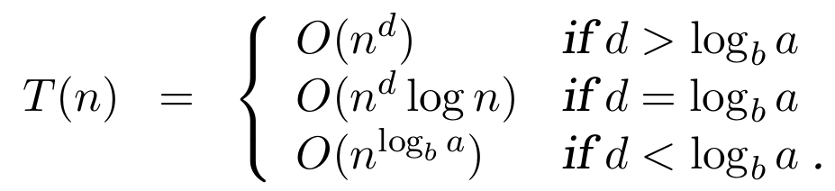

# 数学基础

## Master 定理

Master定理是用来分析**分治算法**的时间复杂度。对于 $$ T(n) = a T(\frac{n}{b}) + O(n^d) $$:

常数a, b, c分别对应: (1) divide, (2) conquer, (3) combine.

Master定理的证明不是很重要，主要是要有一个tree的思想：

通过几个例子来理解master定理，主要体会一下是怎么卡住那个函数的边界的。

1. 整数相乘算法 [DPV 2.2]
1. 矩阵相乘算法 [DPV 2.5]
1. 多项式相乘算法 （略复杂） [DPV 2.6]

参考章节：[DPV 2.2], [CLRS 4]
