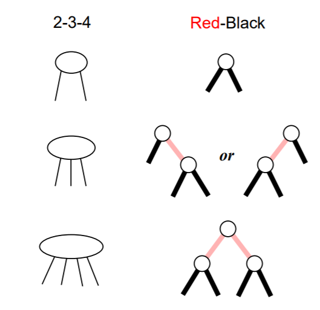

# 红黑树

## 概念

+ _2-3 树_：3 阶 B 树
+ _2-3-4 树_：4 阶 B 树
+ _红黑树 (Red-black tree)_：定义略
+ _左偏红黑树 (Left-leaning red-black tree)_：红黑树的变体，红色结点只出现在左孩子的红黑树

红色边与红色结点的关系：**红色本质上是结点的颜色**，边的颜色实际上是它下方结点（子结点）的颜色。

### 2-3 树、2-3-4 树和红黑树的对应关系

+ 2-3 树和左偏红黑树等价（左偏红黑树是 2-3 树的二叉树实现）
+ 2-3-4 树和红黑树等价（红黑树是 2-3-4 树的二叉树实现）
  + 将红色边放平，并合并红色边连接的结点，红黑树即转化成 2-3-4 树

红黑树的四个性质：

+ 每个结点不是红色就是黑色
+ 根结点和叶结点 (nil) 是黑色
+ 红色结点的子结点一定是黑色
+ 根结点到任意叶结点的路径上黑色结点数量相等
  + 本质上就是 B 树的性质——所有叶结点深度相等
  + Black-height 实际上就是 B 树中结点的高度

红黑树的插入调整算法与 2-3-4 树的对应关系（参考《算法导论》中的 `RB-Insert-Fixup`）：

| 红黑树调整 | 2-3-4 树调整 |
| :-: | :-: |
| 新插入的结点 (z) 默认为红色 | 新插入的结点一开始放在叶结点 |
| 若 z 父为红色，则需要调整 | |
| Case 1: z 叔为红色，则 z 父、z 叔黑化，z 祖父红化 | 4-node 在 [0] 或 [1] 位置插入了一个 key，分裂成 3-node 和 2-node，并向上扔一个 key |
| Case 2：z 叔为黑色，且 z 为左子，则将 z 与 z 父 rotate-left，再如 case 3 操作 | 3-node 在 [1] 位置插入了一个 key，变成 4-node |
| Case 3：z 叔为黑色，且 z 为右子，则 z 父黑化，z 祖父红化，并将 z 父与 z 祖父 rotate-right | 3-node 在 [0] 位置插入了一个 key，变成 4-node |

## 参考资料

+ [2-3 树与红黑树](http://xiaoyue26.github.io/2018/04/22/2018-04/2-3%E6%A0%91%E4%B8%8E%E7%BA%A2%E9%BB%91%E6%A0%91/)