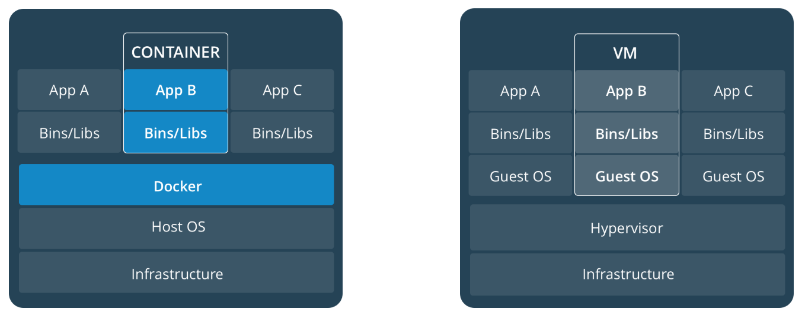

# 容器化

## Docker

Image 和 container 的关系：container 是 image 的一个**实例 (instance)**。`docker images` 查看所有 image；`docker ps` 查看所有运行的 container。

分布式应用的三个 level:

+ 容器 (container)
+ 服务 (service)
  + 分布式系统中的每一个部分叫做一个 service
  + Service 实际上就是**在生产环境的容器**
+ 服务栈 (stack)
  + 一系列相关的、互相依赖的服务
  + 服务栈一般就可以定义整个分布式应用的功能

### 底层原理

+ Linux namespace
  + https://blog.yadutaf.fr/2013/12/22/introduction-to-linux-namespaces-part-1-uts/
+ Linux cgroup

### 使用细节

将自己的用户添加到 docker group，从而让 docker 命令不需要 sudo.

## Kubernetes