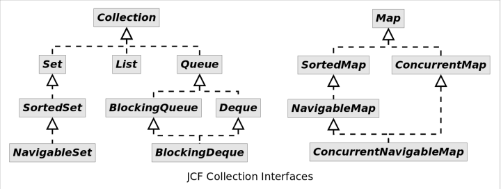
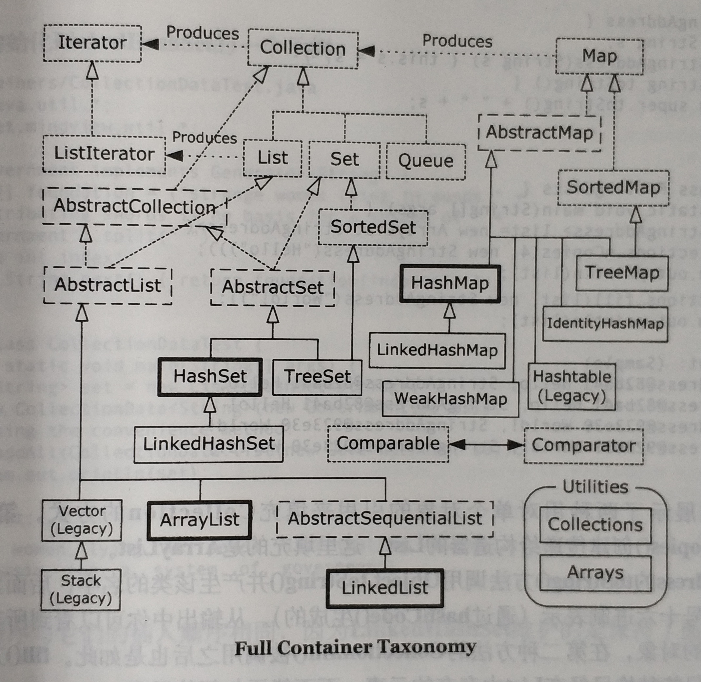

# Java 集合框架

Java 集合框架 (_Java Collections Framework_, JCF) 始于 Java 1.2。

## Collection hierarchy 类结构

集合框架分为两大部分：

+ `Collection` 及其子类
+ `Map` 及其子类
  + 并不是真正的集合，但可以像集合一样操作

所有接口：

### List

### Set

### Queue / Deque

### Map

AbstractCollection, AbstractSet, AbstractList, AbstractSequentialList and AbstractMap 提供了一些基本的实现。

## 实现原理

TODO: 几个关键类的源码剖析

接口与对应的实现：

| 接口 | Hash Table | Resizable Array | Balanced Tree | Linked List | Hash Table + Linked List |
| :-: | :-: | :-: | :-: | :-: | :-: |
| `List` | | `ArrayList` | | `LinkedList` | |
| `Deque` | | `ArrayDeque` | | `LinkedList` | |
| `Set` | `HashSet` | | `TreeSet` | | `LinkedHashSet` |
| `Map` | `HashMap` | | `TreeMap` | | `LinkedHashMap` |

`TreeSet`, `HashSet`, `LinkedHashSet` 都是基于对应的 `Map` 类实现，只是包装了接口（设计模式-**适配器模式**）。

### 动态数组：`ArrayList`, `ArrayDeque`

可增长的动态数组

+ 支持随机访问，`get(i)` = O(1)
+ 插入/删除需要拷贝数据

### 链表：`LinkedList`

双向链表

+ 不支持随机访问，`get(i)` = O(n)
+ 插入/删除只需移动指针，不需要拷贝数据

注意没有 `LinkedDeque` 类，只有 `LinkedList`。`LinkedList` 既实现了 `List` 接口，也实现了 `Deque` 接口。

### 散列表：`HashMap`

散列表

+ Bucket 大小设置为 2 的幂，取模操作转化为位操作
+ 对于 hash 冲突，使用链表连接
  + Java 8 以后，当链表长度超过阈值 (8)，链表会转化成**红黑树**

### 平衡树：`TreeMap`

`TreeMap` 底层使用红黑树实现。https://zhuanlan.zhihu.com/p/24795143?refer=dreawer

### 散列表 + 链表：`LinkedHashMap`

`LinkedHashMap` 基于 `HashMap` 进行扩展，使用双向链表保持顺序性。可以选择两种排序方式：

+ 根据写入顺序排序
+ 根据访问顺序排序

### 其他

TODO: `Vector`, `Stack`, `Hashtable`, `Enumeration`

集合类如果不支持某个操作，会抛出 `UnsupportedOperationException`。

## 迭代器

### Concurrent modification & fail-fast iterator

如果一边操作集合的迭代器，另一边在修改集合，这时候迭代器的行为是不确定的，可能产生 undefined 的结果。一些迭代器在运行时会进行检查，如果发现集合被修改，会抛出 `ConcurrentModificationException`。这种迭代器称为 _fail-fast iterator_。

`AbstractList` 中定义了 `modCount` 变量，表示 list 被修改的次数。`iterator()` 或 `listIterator()` 返回的迭代器中，每次调用 `previous()`, `next()`, `add()`, `set()`, `remove()` 时都会检查这个变量。如果它发生了预料之外的变化，则迭代器抛出 `ConcurrentModificationException`。注意，迭代器的 `remove()` 等方法会造成 `modCount` 改变，但这是预料之中的变化。

+ 无论是多线程环境还是单线程环境，都可能出现 concurrent modification
+ 迭代器与 for-each 循环等价，因此在 for-each 循环中修改集合也会出现 concurrent modification
+ `Vector` 或 `Collection.synchronizedList()` 的迭代器也会产生这个问题
  + 因为它们并非绝对线程安全
  + 使用迭代器时必须加锁
+ `CopyOnWriteArrayList` 可以解决 concurrent modification 的问题
  + 迭代器反映当前容器的 snapshot

## 其他

哪些集合接受 null value？

+ 接受
  + `ArrayList`
  + `LinkedList`
  + `CopyOnWriteArrayList`
  + `HashSet`?, `LinkedHashSet`?
+ 不接受
  + `TreeSet`?
  + `ConcurrentSkipListSet`
  + `ArrayDeque`

## Java 集合框架发展历史

+ Java 1.2
  + 引入集合框架
+ Java 5
  + 增强的 for 循环（利用 iterator）
+ Java 6
  + 引入 `Deque`，取代 `Stack`

## 参考资料

+ [Collections framework overview](https://docs.oracle.com/javase/8/docs/technotes/guides/collections/overview.html)
+ [深入理解 Java 集合框架](https://github.com/CarpenterLee/JCFInternals)
+ JCF 类结构（来自 _Thinking in Java_ 第 17 章）：

