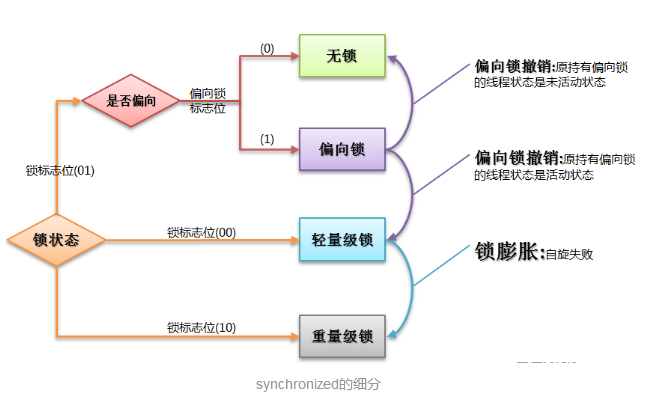

# Java Concurrency - 锁

## 概念

### 互斥锁 (Mutex) 与读写锁 (Reader-writer lock)

Mutex 即 _mutural exclusion lock_。只有一个线程可以拥有这个锁。`synchronized` 和 `ReentrantLock` 都是互斥锁。

读写锁不是互斥的，只有一个线程可以写，但是可以有多个线程同时读。

### 可重入锁 (Reentrant lock)

当一个线程请求一个它已经拥有的锁时，请求会成功。这样的锁叫做可重入锁。可重入锁意味着锁是每个线程分配一个，而不是每次调用分配一个。每个锁会有一个 count，每次 lock / unlock 时 +1 / -1。当 count 为零时锁会被释放。

`synchronized` 关键字和 `ReentrantLock` 都是可重入锁。如果 `synchronized` 没有可重入性，当子类重写了父类的一个 synchronized method 话，会导致 deadlock。

Unix 系统中称这种锁为 recursive mutex，可以在创建 mutex 的时候指定 `PTHREAD_MUTEX_RECURSIVE` 参数。

参考：_Java Concurrency in Practice_ 2.3.2

### 可中断锁

+ `synchronized` -- 不可中断锁
+ `ReentrantLock` -- 可中断锁

### 公平锁与非公平锁

| | 非公平锁 | 公平锁 |
| :-: | :-: | :-: |
| 定义 | 每个线程按 acquire 的先后顺序依次获得锁 | 每个线程获得锁的顺序随机 |
| 例子 | `synchronized`，`ReentrantLock(fair=false)`| `ReentrantLock(fair=true)` |
| 缺点 | 可能导致 starvation | 性能较低（需要维护等待队列）|

### 悲观锁与乐观锁

| | 悲观锁 | 乐观锁 |
| :-: | :-: | :-: |
| 假设 | 总是假设最坏的情况：读数据时数据会被其他线程修改 | 总是假设最好的情况：读数据时数据不会被其他线程修改 |
| 行为 | 对数据上锁 | 不上锁，只在更新的时候检查数据是否被修改了 |
| 例子 | `synchronized`, `ReentrantLock` | 版本号机制，CAS |
| 适用场景 | 多写（冲突较多） | 多读（冲突较少） |
| 缺点 | 阻塞 | ABA 问题，可能长时间不成功 |

### 自旋锁 Spin lock

+ 定义
  + 线程在循环中反复检查锁是否可获取，直到获取到锁
  + 忙等待 (_busy waiting, spinning_)，不切换线程
+ 优点
  + 线程不会阻塞，减少了不必要的上下文切换
+ 缺点
  + 若线程在临界区时间过长，其他线程会持续忙等待，消耗大量 CPU
  + 不公平，可能导致 starvation

自旋锁在**非抢占式调度**系统中比较有用。对于一般的抢占式调度，即使线程进行自旋，当时间片到了，内核依然可以中断其运行，进行调度。

## 锁的两个关键作用

无论是 `synchronized` 关键字，还是 `Lock` 都提供了两点作用：

+ 互斥性 Mutual exclusion
+ 可见性 Memory visibility guarantee （见 _Java Concurrency in Practice_ 3.1 节和 16 章）

`volatile` 关键字只能提供可见性，不能支持互斥性。

## `synchronized` 关键字

`synchronized` 关键字本质上是对某个对象上锁，称为 _built-in lock_ 或 _intrinsic lock_，互斥锁，可重入锁。

任何对象都可以上锁，锁的保存在 _对象头_ 中，参见 JVM 章节。

+ _Synchronized block (同步块)_ 
  + 括号内的对象是 lock object
+ _Synchronized method (同步方法)_
  + 非静态方法：`this` 是 lock object，相当于 `synchronized(this)`
  + 静态方法：`Class` 对象是 lock object

### Java 6 对 `synchronized` 的优化

`synchronized` 原本属于重量级锁，效率较低。Java 6 引入偏向锁、轻量级锁、自旋锁、适应性自旋锁、锁消除、锁粗化等技术对 `synchronized` 进行了优化，效率提升较大。

锁存在四种状态：无锁 -> 偏向锁 -> 轻量级锁 -> 重量级锁，随着竞争的激烈而逐渐升级（不可降级）。这样可以提高获得锁和释放锁的效率。



+ 偏向锁 (_baised lock_)
  + 会偏向于第一个获得它的线程
  + 如果在接下来的执行中，该锁没有被其他线程获取，那么持有偏向锁的线程就不需要进行同步
+ 轻量级锁
  + 使用 CAS 操作
  + 不申请互斥量，避免互斥操作的开销
+ 自旋锁/适应性自旋
  + 忙等待，暂时不挂起线程
  + 适应性自旋可根据执行情况调整忙等待的时间
+ 锁消除
  + 去除冗余的锁（不可能存在竞争）
+ 锁粗化
  + 避免反复加锁解锁

## `java.util.concurrent.locks` 中的锁

+ `Lock`
  + `ReentrantLock`
  + `ReadLock`
  + `WriteLock`
+ `ReadWriteLock`
  + `ReentrantReadWriteLock`

### `ReentrantLock`

`ReentrantLock`，互斥锁，可重入锁。`lock` 对应于进入 `synchronized` 块； `unlock` 对应于退出 `synchronized` 块。功能与 `synchronized` 类似，但是使用更加灵活。`ReentrantLock` 相比 `synchronized` 的优点：

+ 不必基于块结构 (synchronized block)
  + lock 和 unlock 的位置更灵活
+ 可以设置为公平锁
  + `ReentrantLock(boolean fair)`
+ 和 `Condition` 配合，同步控制更好用
+ 获取锁的过程不一定是阻塞的 (见 JCIP 13.1.1)
  + 使用 `tryLock`
  + 叫做 _timed lock acquisition_
  + 方便在有时间限制的任务中使用锁
+ 获取锁的过程是可中断的 (见 JCIP 13.1.2)
  + 使用 `lockInterruptibly`
  + 叫做 _interruptible lock acquisition_
  + 方便在可取消的任务中使用锁
+ 可以控制多个线程同时读
+ 可以知道线程是否成功获取了锁

通常的使用模式：

```Java
Lock lock = new ReentrantLock();
...
lock.lock();
try {
    // update object state
} catch (...) {
    // restore invariants, if necessary
} finally {
    lock.unlock(); // 注意：必须在 finally 中释放锁，否则一旦出现异常，则无法释放锁
}
```

### `ReadWriteLock`

允许多个线程同时读

## CAS 与无锁数据结构

### CAS (compare and swap) 原子操作

基于 CPU 提供的原子操作指令实现，如 x86 的 `CMPXCHG` 指令。
CAS 是一种无锁的原子操作，用来实现 lock-free 的数据结构。

参考：

+ [Compare-and-swap - Wikipedia](https://en.wikipedia.org/wiki/Compare-and-swap)
+ [无锁队列的实现 - 酷壳](https://coolshell.cn/articles/8239.html)
