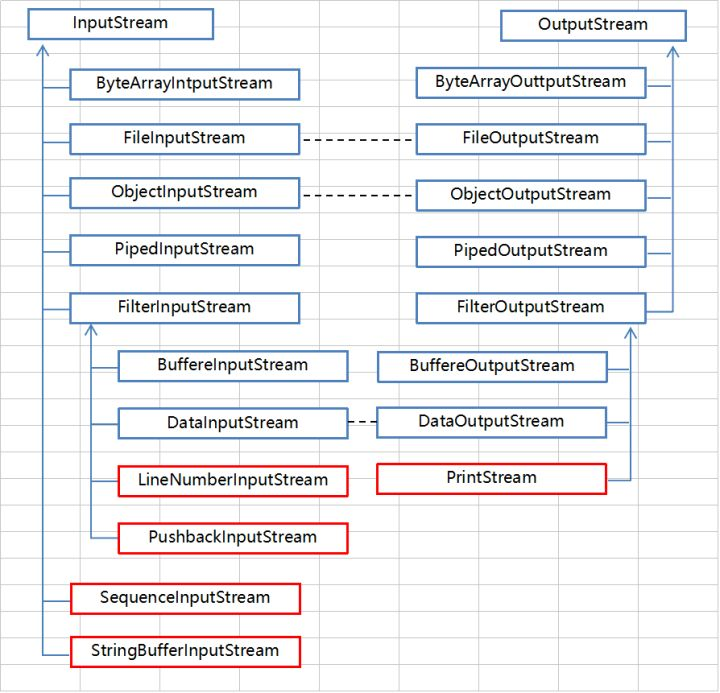

# Java IO

IO 分为阻塞型 IO 和非阻塞型 IO（NIO）。

IO 使用**流 (stream)** 作为数据的传输方式，分为**字节流**和**字符流**。

NIO 使用**通道 (channel)** 作为数据的传输方式，通道的数据传输是双向的、异步的。

## IO 流

| | 字节流 | 字符流 |
| :-: | :-: | :-: |
| 输入流 | `InputStream` | `Reader` |
| 输出流 | `OutputStream` | `Writer` |

根据 IO 流中数据的来源，流还可以分为**节点流（原始流）** 和 **链接流（装饰流）**。

### 字节流

InputStream

+ `read()`
+ `read(byte[])`
+ `read(byte[], int, int)`
+ `skip(long)`
+ `available()`
+ `close()`
+ `mark(int)`, `reset()`, `markSupported()`

OutputStream

+ `write()`
+ `write(byte[])`
+ `write(byte[], int, int)`
+ `flush()`
+ `close()`

基本的介质流：

+ `FileInputStream` / `FileOutputStream` 从文件读/写数据（大部分是 native 方法）
+ `ByteArrayInputStream` / `ByteArrayOutputStream` 从字节数组读/写数据
+ <del>`StringBufferInputStream` 从字符串读数据</del> (deprecated)



### 字符流

基本的介质流：

+ `FileReader` / `FileWriter` 从文件读/写数据 （利用 `InputStreamReader` / `OutputStreamWriter`）
+ `CharArrayReader` / `CharArrayWriter` 从字符数组读/写数据
+ `StringReader` / `StringWriter` 从字符串读/写数据


### 字节流与字符流的转换

+ `InputStreamReader`
+ `OutputStreamWriter`

这是设计模式-**适配器模式**。

## IO 类库

### 装饰者模式

`FilterInputStream` 中包含了另一个 input stream，使用它的数据源（即将 `read` 委托给另一个 input stream），并进行一些数据转换的工作（如 `DataInputStream` 将字节数据转换为 Java 中的 `int`, `long`, `float`）或提供额外的功能（如`BufferedInputStream` 提供缓存功能）。这是设计模式-**装饰者模式**。

使用方式：

```Java
String filename = "a.txt";
InputStream is = new InputStream(filename);
BufferedInputStream bis = new BufferedInputStream(is);
```

`FilterOutputStream`, `FilterReader`, `FilterWriter` 同理。

### Standard I/O

+ stdin -- `System.in`
+ stdout -- `System.out`
+ stderr -- `System.err`

`System.out` 和 `System.err` 都是`PrintStream` 对象，支持 print 系列函数。而 `System.in` 却是原始的 `InputStream`。因此在使用 `System.in` 之前需要进行必要的包装（例如用 `BufferedInputStream` 添加缓存，或用 `InputStreamReader` 适配为字符流）。

### 其他

`RandomAccessFile` 是一个特立独行的类。

`Scanner` 和 `PrintWriter` 是常用了两个输入/输出工具类。`PrintWriter` 是 `Writer` 的子类，添加了对各种 print 函数的支持。`Scanner` 在 `java.util` 中，内部使用了 IO 类库。

## NIO

NIO 在 Java 1.4 引入，目的是提高速度。旧的 IO 类库也用 NIO 重新实现了。NIO 使用更接近操作系统 IO 的方式：使用 _通道 (channel)_ 和 _缓冲器 (buffer)_。NIO 是一种非阻塞型 IO。

## Java IO 类库发展历史

+ Java 1.0
  + `InputStream`, `OutputStream`
+ Java 1.1
  + `Reader`, `Writer`
+ Java 1.4
  + NIO