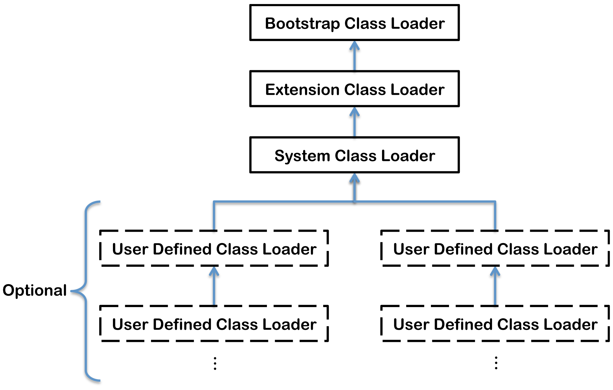

# Java 虚拟机 - 代码执行

## Class 文件格式

`javap` 常用参数：`-v`, `-p`。

常量池：主要存放两大类常量：字面量和符号引用。

### 常量池

11 大常见类型：

+ Literal 字面量
  + Utf8 基础！
  + Integer
  + Float
  + Long
  + Double
  + String
+ Symbolic reference 符号引用
  + Class [类名 (fully qualified): Utf8]
  + NameAndType [Name: Utf8], [描述符: Utf8]
  + Fieldref [类或接口: Class], [Field: NameAndType]
  + Methodref [类: Class], [Method: NameAndType]
  + InterfaceMethodref [接口: Class], [Method: NameAndType]

### 描述符 Descriptor

+ 对于 field —— 类型
+ 对于 method —— 参数类型（按顺序）、返回类型

例如，`Object.equals()` 的描述符：`(Ljava/lang/Object;)Z`。

## 字节码指令 Bytecode instructions

所有的字节码指令都放在方法的 Code 属性中。

### 基本指令

+ `iconst` 将整数常量放在 operand stack 上
+ `istore` 从 operand stack 上 pop 一个值存储在 local variable 中
+ `iload` 从 local variable 中加载一个值，push 到 operand stack 上

### 函数调用

+ `invokestatic` 调用静态方法
+ `invokevirtual` 调用普通方法
  + 需要传递对象实例作为第一个参数（成为方法中的 `this`）
+ `invokespecial` 调用特殊方法
  + `<init>`
+ `return` 返回

### 参数传递

+ 调用者将参数按顺序（从左至右依次 push）放在 operand stack 上
+ 被调用者从 local variable array 中获取参数
+ 被调用者将返回值放在 operand stack 上
+ 调用者从 operand stack 上获取返回值

### 对象创建

+ 使用 `new` 在堆区创建内存空间，返回对象引用
+ 使用 `dup` 复制对象引用
+ 使用 `invokespecial <init>` 调用 constructor
  + 第一个参数需要是对象引用
  + 无返回值

### 异常

#### 抛出异常

+ 显式抛出异常：`athrow` 指令
+ 隐式抛出异常：如整数除零异常

#### 处理异常

旧的方式：使用 `jsr` 和 `ret` 指令。现已废弃。JDK 1.7 已经完全禁止使用这两条指令。

新的方式：使用**异常表**。异常表（exception table）是 Code 属性中的一部分。异常表的含义：如果当字节码在 [start_pc, end_pc) 之间出现了类型为 catch_type 或其子类的异常，则转到 handler_pc 行继续运行。catch_type = 0 时表示任意异常（用于支持 `finally` 语句块）。

### 同步

JVM 中的 synchronization 都是通过 _monitor_ 来实现的。

+ Case 1: synchronized method
  + 方法添加 `ACC_SYNCHRONIZED` 标识（保存在 `method_info` 中）
  + 方法调用的指令（如 `invokevirtual`）会自动进出 monitor
+ Case 2: synchronized block
  + 在同步块的开始/结束位置使用 `monitorenter` / `monitorexit` 指令
  + 要上锁的对象作为第一个参数放在栈顶

JVM 会检查代码中 monitor 的进出操作是否能对应上（叫做满足 _structured locking_ 性质）。

### IA-32 汇编指令与 Java 字节码指令的对比

| | 汇编 | 字节码 |
| :-: | :-: | :-: |
| 模型 | 基于寄存器 | 基于操作数栈 (operand stack)（大小在编译时确定）|
| 局部变量保存位置 | 寄存器，寄存器放不下放在栈中 | 局部变量数组（大小在编译时确定）|
| 指令长度 | 变长 | 变长 |
| 函数调用指令 | `call` / `ret` | `invoke*` / `return` |
| 栈帧管理 | 函数一开始保存 `%ebp` 旧值，以及移动 `%esp` | 自动管理，包括传递操作数栈或局部变量数组的内容 |
| 参数传递 | 调用者放在自己的栈帧底部，被调用者从调用者栈帧获取 | 调用者放在自己的操作数栈，会自动拷贝到被调用者的局部变量数组，被调用者从自己的局部变量数组中获取 |
| 返回值传递 | 一般放在 `%eax` 寄存器中 | 被调用者放在自己的操作数栈，会自动拷贝到调用者的操作数栈，调用者从自己的操作数栈中获取 |

## 类加载器 Classloader

### （广义）类加载的过程

+ Loading
+ Linking
  + Verifying
  + Preparing
  + Resolving
+ Initialization

类加载器做的实际上只是 loading 阶段的第一步”根据类名读取 class 文件为字节数组“。

#### 1. Loading

+ 根据类名，读取 class 文件（为字节数组）
+ 从字节表示中解析出 `Class` 对象
+ 所有的父类也会 load 进来

#### 2.1 Verifying

进行多项检查，保证 class 或 interface 结构上正确，符合 JVM 语义规范

#### 2.2 Preparing

+ 分配内存空间，如 method table
+ 为 static fields 分配空间，并初始化

#### 2.3 Resolving

+ 检查符号引用
+ 可以省略，推迟到指令执行前

#### 3. Initialization

+ 调用 `<clinit>`

关于 `<clinit>`：

+ `<clinit>` 是由编译器生成的
+ `<clinit>` 中的内容包括（以源文件中定义的顺序）
  + `static {}` 块（interface 没有）
  + Static fields 的赋值
+ Interface 没有 `static {}` 块，但有 static fields，所以仍然有 `<clinit>`
+ JVM 保证子类的 `<clinit>` 执行前，父类的 `<clinit>` 一定已经执行完毕（但 interface 除外）

### 什么时候进行类加载

会进行类加载的情况：

+ 遇到 `new`, `getstatic`, `putstatic`, `invokestatic` 指令时
+ 对类进行反射调用的时候
+ 当加载一个类的时候，需要先加载它的父类（interface 并无此要求）
+ 虚拟机启动时，会加载 main class

不会进行类加载的情况：

+ 通过子类引用父类的 static field
+ 初始化数组类时不会初始化元素类
+ 常量的传播优化导致表面上引用的类实际上没有引用

### Classloader 的种类

+ _Bootstrap classloader_
  + 最顶层的 classloader
  + 通常用 native code 如 C++ 实现
  + 加载 `<JAVA_HOME>/jre/lib` 下的最基础的 Java API
  + 会跳过很多 validation 过程
+ _Extention classloader_
  + 加载 `<JAVA_HOME>/jre/lib/ext` 下的 standard Java extension APIs
+ _System classloader_
  + 默认的 application classloader
  + 加载 `CLASSPATH` 下的 application classes
+ User defined classloaders
  + 用来加载 application classes



### Classloader 与 namespace

（出于安全的考虑？），每个不同的 classloader 代表了一个不同的 namespace。`(class loader, qualified class name)` 确立了一个类在 JVM 中的唯一性。

同一个 class 文件由不同的 classloader 加载出来是不同的类。两个 `Class` 对象的 `equals()`, `isAssignableFrom()`, `isInstance()` 的结果会受影响，使用 `instanceof` 判断对象的结果也会受影响。

### 双亲委派模型（父辈代理） Parent Delegation Model

**首先尝试委派给父加载器完成，然后再尝试自己加载（递归过程）**。

`java.lang.ClassLoader` 中的 `loadClass()` 方法给出了双亲委派模型的实现。它会按如下顺序查找类：

1. 调用 `findLoadedClass()` 检查这个类是否已经加载了
2. 调用父加载器（parent class loader）的 `loadClass` 方法。如果 parent 为 null，则使用 JVM 内置的类加载器。
3. 调用自己的 `findClass()` 方法来查找类

```Java
protected Class<?> loadClass(String name, boolean resolve) throws ClassNotFoundException {
    synchronized (getClassLoadingLock(name)) {
        // First, check if the class has already been loaded
        Class<?> c = findLoadedClass(name);
        if (c == null) {
            long t0 = System.nanoTime();
            try {
                if (parent != null) {
                    c = parent.loadClass(name, false);
                } else {
                    c = findBootstrapClassOrNull(name);
                }
            } catch (ClassNotFoundException e) {
                // ClassNotFoundException thrown if class not found from the non-null parent class loader
            }

            if (c == null) {
                // If still not found, then invoke findClass in order to find the class.
                long t1 = System.nanoTime();
                c = findClass(name);

                // this is the defining class loader; record the stats
                sun.misc.PerfCounter.getParentDelegationTime().addTime(t1 - t0);
                sun.misc.PerfCounter.getFindClassTime().addElapsedTimeFrom(t1);
                sun.misc.PerfCounter.getFindClasses().increment();
            }
        }
        if (resolve) {
            resolveClass(c);
        }
        return c;
    }
}
```

好处：

+ 保证同一个类是由同一个 classloader 加载
  + 避免由于 namespace 问题导致不同的类

其他：

+ 在 Java 1.2 中引入，此后被广泛使用
+ 不是强制性的模型，只是推荐的实现方式