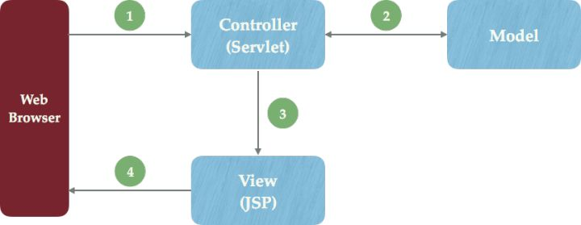

# Java Web

## Servlet & JSP

1、不同之处在哪？

+ Servlet 在 Java 代码中通过 HttpServletResponse 对象动态输出 HTML 内容
+ JSP 在静态 HTML 内容中嵌入 Java 代码，Java 代码被动态执行后生成 HTML 内容

2、各自的特点

+ Servlet 能够很好地组织业务逻辑代码，但是在 Java 源文件中通过字符串拼接的方式生成动态 HTML 内容会导致代码维护困难、可读性差
+ JSP 虽然规避了 Servlet 在生成 HTML 内容方面的劣势，但是在 HTML 中混入大量、复杂的业务逻辑同样也是不可取的

3、通过MVC双剑合璧

既然 JSP 和 Servlet 都有自身的适用环境，那么能否扬长避短，让它们发挥各自的优势呢？答案是使用模式解决这一问题。

+ Controller——负责转发请求，对请求进行处理
+ View——负责界面显示
+ Model——业务功能编写（例如算法实现）、数据库设计以及数据存取操作实现

在 JSP/Servlet 开发的软件系统中，这三个部分的描述如下所示：

+ Web浏览器发送HTTP请求到服务端，被Controller(Servlet)获取并进行处理（例如参数解析、请求转发）
+ Controller(Servlet)调用核心业务逻辑——Model部分，获得结果
+ Controller(Servlet)将逻辑处理结果交给View（JSP），动态输出HTML内容
+ 动态生成的HTML内容返回到浏览器显示

MVC 模式在 Web 开发中的好处是非常明显，它规避了 JSP 与 Servlet 各自的短板，Servlet 只负责业务逻辑而不会通过 out.append() 动态生成HTML代码；JSP 中也不会充斥着大量的业务代码。这大大提高了代码的可读性和可维护性。

### Container

Tomcat 是一个 Servlet 容器 (container)，也兼有 Web 服务器的功能。

### JSP

JSP 也会被编译成 Servlet，都是 `HttpServlet` 的子类。

### Servlet

Servlet 的生命周期

+ 实例化 (new)
  + 第一次请求此 Servlet 时，容器会实例化 Servlet 对象
  + 每一个 Servlet 对象在容器中只有一个实例对象（单例）
+ 初始化 (init)
  + 创建完 Servlet 对象后，调用 `init()` 初始化，使其真正拥有 servlet 的功能
  + `init()` 在 Servlet 对象的一生中只会被调用一次
+ 执行处理 (service)
  + 每个请求到来的时候，会创建一个 servlet 线程，调用 `service()` 方法
  + 请求分派到 `doGet()`, `doPost()` 等方法
  + `service()` 方法结束时，线程被销毁或者回收回线程池
+ 销毁 (destroy)
  + 服务器关闭或重启时，调用 `destroy()` 方法销毁 servlet

（图片来自 _Head First Servlets & JSP_, Chapter 4, Page 97）