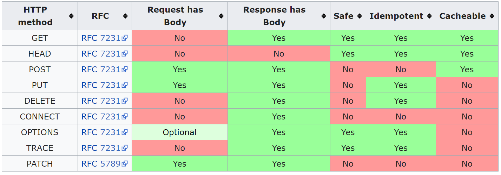

# HTTP

+ 运行在 TCP 之上
+ 使用 80 端口 / 443 端口 (HTTPS)
+ 请求 (_request_) / 响应，应答 (_response_)

## 消息格式

注意：每一行末尾使用 CR LF (`"\r\n"`) 换行。

HTTP 请求的格式：

+ _Request line_
  + 例如，`GET /images/logo.png HTTP/1.1`
+ _Request header fields_
  + 每行一个 header field
+ 一个空行
+ _Message body, entity body_ (可选)
  + GET 方法的 entity body 为空

HTTP 响应的格式：

+ _Status line_
  + 例如，`HTTP/1.1 200 OK`
+ _Response header fields_
+ 一个空行
+ _Message body, entity body_ (可选)

## 请求方法 (method)

+ GET
+ HEAD
+ POST
+ PUT
+ PATCH —— 修改部分资源
+ DELETE
+ TRACE —— 回显服务器收到的请求，主要用于测试或诊断
+ OPTIONS —— 使服务器传回该资源所支持的所有 HTTP 请求方法
+ CONNECT —— HTTP/1.1 协议中预留给能够将连接改为管道方式的代理服务器，通常用于 SSL 加密服务器的链接

HTTP 服务器至少应该实现 GET 和 HEAD 方法，其他方法都是可选的。

### 安全性

如果一个方法是安全的 (_safe_)，那么使用这个方法请求应当只返回信息，而不会改变 server 的状态。安全的=无副作用的。

### 幂等性

如果一个方法是幂等 (_idempotent_) 的，那么使用这个方法请求任意次和请求一次的效果相同。无副作用的方法一定是幂等的。

+ 幂等方法
  + 无副作用：GET, HEAD, OPTIONS, TRACE
  + 有副作用：PUT, DELETE
+ 非幂等方法
  + POST, PATCH

PATCH 方法不一定是幂等的，由于是部分修改资源，可能第一次修改是合法的，而第二次以后的修改就会报错（例如：patch 的格式为 `{'change': 'name', 'from':, 'Benjamin Franklin', 'to': 'John Doe'}`）。不过服务器可以选择将 PATCH 方法实现为幂等的。

## HTTP 状态码 (status code)

+ 1xx —— 信息性状态码
+ 2xx —— 成功状态码
  + 200 OK —— 最普通的状态码
  + 201 Created —— POST 请求的返回码
  + 204 No Content —— DELETE 请求的返回码
+ 3xx —— 重定向状态码
  + 301 Moved Permanently —— 需要客户端进行**重定向**
    + 在 header 的 `Location` 中告知新的地址
    + 客户端以后应当去新地址下载
  + 302 Found (Moved Temporarily) —— 需要客户端进行重定向
    + 在 body 中告知新的地址
    + 客户端以后仍应在原地址下载
  + 304 Not Modified —— 客户端人可以使用之前缓存的内容
    + 需要 header 中 `If-Modified-Since` 或 `If-None-Match`
+ 4xx —— 客户端错误状态码
  + 400 Bad Request —— 明显的客户端错误
  + 401 Unauthorized —— 没有提供认证信息
  + 403 Forbidden —— 服务器已经理解请求，但是拒绝执行
  + 404 Not Found —— 请求的内容不存在
    + 如果服务器不想透露请求为何拒绝，可以使用 404
  + 405 Method Not Allowed —— 不支持该 method (如 PUT)
  + 406 Not Acceptable —— 资源格式不符合要求
+ 5xx —— 服务器错误状态码
  + 500 Internal Server Error —— 通用错误消息
  + 501 Not Implemented —— 服务器未实现该功能
  + 502 Bad Gateway —— 网关(代理)返回的错误
  + 503 Service Unavailable —— 服务暂时不可用（如由于维护）
  + 505 HTTP 协议版本不支持

### Forward 和 redirect

+ Forward (转发): 服务器行为，服务器获取跳转页面内容传给用户，用户地址栏不变
+ Redirect (重定向): 客户端行为，本质上为两次请求，地址栏改变，前一次请求对象消失
  + HTTP 301

## HTTP header fields

分为 _request fields_ 和 _response fields_。非标准的 fields 一般以 `X-` 开头。

### 常见的 header fields

+ 请求
  + Host: 主机名
  + Connection: keep-alive 或 close
  + User-agent: 浏览器类型
  + Content-Type: 如 application/x-www-form-urlencoded (POST 表单)
+ 响应
  + Connection: keep-alive 或 close
  + Date: 响应的日期+时间
  + Server: 服务器类型
  + Content-Length: TODO
  + Content-Type: 如 text/html, text/javascript, application/json, image/jpeg

详见：[List of HTTP header fields](https://en.wikipedia.org/wiki/List_of_HTTP_header_fields)

### 连接相关

### 缓存相关

+ Server: `Last-Modified`
+ Browser: `If-Modified-Since`, `If-None-Match`

常见流程：

+ 第一次请求
  + 浏览器发送请求
  + 服务器的响应中包含 `Last-Modified: [date + time]`
  + 浏览器缓存该文件，并保存 date + time
+ 后续请求
  + 浏览器发送条件 GET 请求，包含 `If-Modified-Since: [date + time]`
  + 如果文件未被修改，则服务器返回 304 Not Modified
  + 如果文件被修改了，服务器返回新的文件

## HTTPS

HTTPS 实际上就是 HTTP + SSL/TLS。即先用 SSL 或 TLS 对 HTTP 报文进行加密，再作为 TCP 数据进行传输。从网络的层级结构来看，SSL/TLS 位于 TCP 之上，HTTP 之下。

HTTPS 在传输数据之前需要客户端与服务器进行一个握手 (TLS/SSL 握手)，在握手过程中将确立双方加密传输数据的密码信息。

参考：[图解 SSL/TLS 协议](http://www.ruanyifeng.com/blog/2014/09/illustration-ssl.html)

## HTTP 长连接 (keep-alive)

_HTTP 持续连接 (HTTP persistent connection, HTTP keep-alive, HTTP connection reuse)_ 是指使用同一个 TCP 连接来发送和接收多个 HTTP 请求/应答，而不是每个 HTTP 请求/应答 就打开一个新的连接。

HTTP/1.0 中没有内置的 keep-alive 的支持。需要使用 header field: `Connection: Keep-Alive`，在请求和响应中均添加该 header field。

在 HTTP 1.1 中，所有的连接默认都是持续连接，除非显示声明关闭。

## Stateful web service

TODO Cookie 和 Session
https://www.zhihu.com/question/19786827

Stateful / stateless application:

+ Stateful: 为每个 client session 存储数据，供下次使用
+ Stateless: 不存储关于 client session 的状态，每次请求都如同第一次请求一样

HTTP 协议是 stateless 的，但可以通过一些手段模拟出 stateful 的体验，即实现 session。Session 是一个抽象的概念（OSI 七层模型第 5 层），是 user 和 server 之间一对一的交互。

Cookie 是实现 session 的一种机制。如果浏览器禁用了 cookie，还可以在 URL 中传递 session id。

### Session

+ Server 返回给 client 一个 _session identifier_
+ Client 在后续的请求中将 session id 作为 request 的一部分
+ Key-value 结构
  + Key: session id
  + Value: session data
+ Client 存储 session id，server 存储 session data 以及 key-value 结构

### Cookie

Cookie 是保存在浏览器中的、包含 session 数据的小文件。

+ 第一次访问网站时，server 发送 session 数据，浏览器保存为 cookie
  + Response header 中包含 `set-cookie` 字段
  + 登录后，cookie 中包含一个 `user_session` 之类的字段
+ 其后访问网站时，浏览器发送 cookie，server 会比较 client-side 的 cookie 与 server-side 的 session 数据
  + request header 中包含 `cookie` 字段
  + 用户保持登录状态
+ 如果在浏览器删除了 cookie，相当于退出登录

Cookie 的一个重要作用是实现 session。不过 cookie 也有其他的作用，例如保存用户名和密码。