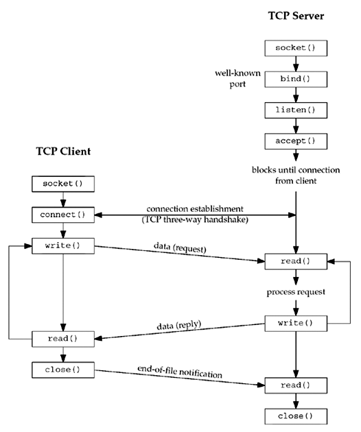
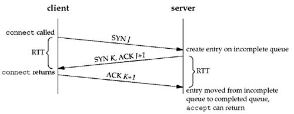
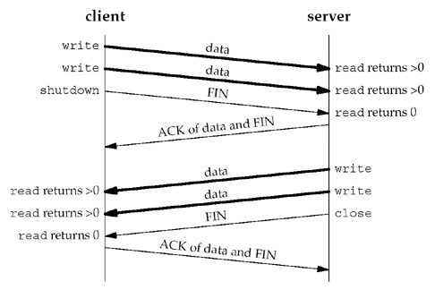

# 网络编程

## 基本流程

（图片来自 _Unix Network Programming, Volumn I_ Section 4.2 Figure 4.1）

（图片来自 _Unix Network Programming, Volumn I_ Section 2.6 Figure 2.5）

### 初始工作

调用 `socket()` 返回 _socket descriptor (sockfd)_。

调用 `bind()` 指定自己的 IP 和端口号。TCP 协议中一般指定端口号（80），不指定 IP。

### 建立连接

Server 的三次状态转移：

+ 调用 `listen()`
  + CLOSED -> LISTEN
  + 将 socket 变为 passive socket，即 passive open
+ 收到 client 发来的 SYN（第一次握手）
  + LISTEN -> SYN_RCVD
+ 收到 client 发来的 ACK（第三次握手）
  + SYN_RCVD -> ESTABLISHED

Kernel 会维护两个队列：

+ _Incomplete connection queue_
  + 收到了 client 发来的 SYN，等待三次握手完成
  + SYN_RCVD 状态
+ _Completed connection queue_
  + 三次握手已经完成
  + ESTABLISHED 状态

每次调用 `accept()`，会从 completed connection queue 中取出一项。如果队列为空，则进程阻塞。`accept` 返回的是一个全新的 fd（指向 TCP 连接，称为 _connected socket_），和 sockfd（称为 _listening socket_）不同。

服务器先用 `listen()` 表明愿意接收请求，接下来：

+ 用 `accept()` 阻塞等待
+ 用 `select()` / `poll()` / `epoll()` 多路等待

### 断开连接

+ `close()` 同时关闭读写（第一、三次挥手）
+ `shutdown()` 可以只关闭写，继续读（第三次挥手）

（图片来自 _Unix Network Programming, Volumn I_ Section 6.6 Figure 6.12）