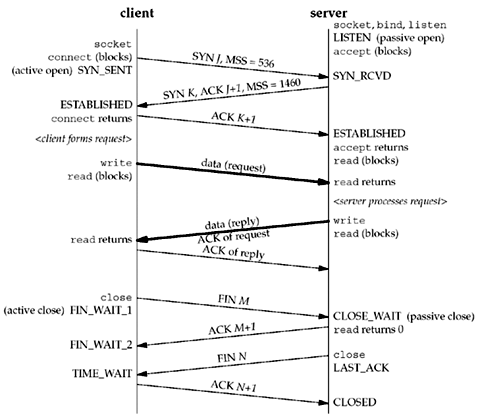

# 网络编程

## 基本流程


（图片来自 _Unix Network Programming, Volumn I_ Section 4.2 Figure 4.1）



（图片来自 _Unix Network Programming, Volumn I_ Section 2.6 Figure 2.5）

## 初始工作

### 初始工作 - 服务器

+ 调用 `socket()` 返回 _socket descriptor (sockfd)_
+ 调用 `bind()` 指定自己的 IP 和端口号
  + TCP 协议中一般指定端口号（80），不指定 IP

### 初始工作 - 客户端

+ 调用 `socket()`，返回 sockfd
+ 注意：客户端不需要调用 `bind()`

## 建立连接

### 建立连接 - 服务器

Server 的三次状态转移：

+ 调用 `listen()`
  + CLOSED -> LISTEN
  + 将 socket 变为 passive socket，即 passive open
+ 收到 client 发来的 SYN（第一次握手）
  + LISTEN -> SYN_RCVD
+ 收到 client 发来的 ACK（第三次握手）
  + SYN_RCVD -> ESTABLISHED


Kernel 会维护两个队列：

+ _Incomplete connection queue_
  + 收到了 client 发来的 SYN，等待三次握手完成
  + SYN_RCVD 状态
+ _Completed connection queue_
  + 三次握手已经完成
  + ESTABLISHED 状态

每次调用 `accept()`，会从 completed connection queue 中取出一项。如果队列为空，则进程阻塞。`accept` 返回的是一个全新的 fd（指向 TCP 连接，称为 _connected socket_），和 sockfd（称为 _listening socket_）不同。

### 非阻塞 accept


### 建立连接 - 客户端

+ 调用 `connect()`
  + 需要指定 IP 地址和端口号
  + CLOSED -> SYN_SENT -> ESTABLISHED
  + 进行三次握手过程

### 非阻塞 accept / connect

sockfd 默认是阻塞的，客户端调用 `connect()` 和服务器调用 `accept()` 都是阻塞的。但可以使用 `fcntl` 将 sockfd 设置为非阻塞的，然后在其上调用的方法就成为非阻塞的。

```C
int flags = fcntl(sockfd, F_GETFL, 0);
fcntl(sockfd, F_SETFL, flags | O_NONBLOCK);
```

何时会阻塞：

+ 对于 `accept`
  + 当没有新的连接时
+ 对于 `connect`
  + 会一直阻塞到三次握手完成（一个 RTT 的时间）

非阻塞 accept / connect 的返回值：

+ `accept()`
  + 返回 -1，错误码 `EAGAIN` 或 `EWOULDBLOCK`，表示没有请求到来
  + Linux 下，`accept()` 返回的 connected sockfd **不会**继承 `O_NONBLOCK` 性质
+ `connect()`
  + 返回 -1，错误码 `EINPROGRESS`，表示连接不能立刻完成

非阻塞的 accept / connect 可以更好地和 select 搭配使用。

+ 服务器可以使用 select 多路等待，不必阻塞在 `accept()` 上
+ 非阻塞 connect，三次握手在后台进行时，可以用 select 来检查连接是否建立

非阻塞 connect 的用处：

+ 在三次握手的时候干些别的事情
  + 因为三次握手需要一个 RTT 的时间，至少有几百毫秒
+ 同时建立多个连接
  + 浏览器打开多个标签页时很有用
+ 在使用 select 的时候设置 timeout，可以缩短 connect 的 timeout 设置

非阻塞 connect 参考 _Unix Network Programming, Volumn I_, Section 16.3

## 读写数据

直接在 connected socket fd 上调用 `read()` 和 `write()` 即可。

也可以用 `send` / `recv`，类似 `write` / `read`，但多了一个 flags 参数。当 flag 为 0 的时候， `send` / `recv` 等价于 `write` / `read`。

### 非阻塞 I/O

何时会阻塞：

+ 对于读 `read`, `recv`
  + 当 _socket receive buffer_ 中没有数据
+ 对于写 `write`, `send`
  + 当拷贝数据到 _socket send buffer_ 时，socket send buffer 已满

非阻塞 I/O 的返回值：

+ `recv()`, `send()`
  + 返回 -1，错误码 `EAGAIN` 或 `EWOULDBLOCK`，表示读/写操作会阻塞
+ `read()`, `write()`
  + 返回 -1，错误码 `EAGAIN` 或 `EWOULDBLOCK`，表示读/写操作会阻塞
  + 注意如果读/写的是文件而不是 socket，则只会有 `EAGAIN` 错误码

## 断开连接

Client 调用 `close()` 关闭 connected socket，或者在 `exit()` 的时候自动关闭打开的 fd。Client 的 socket 关闭时，会发送 FIN。

Client 发来的 FIN 会使得 server 的 `read()` 返回 0（即 EOF，读到 0 个字节）。

关闭 socket 还可以用 `shutdown()`，只关闭一半连接（双工连接变成单工）。

+ `close()` 同时关闭读写（第一、三次挥手）
+ `shutdown()` 可以只关闭写，继续读（第三次挥手)


（图片来自 _Unix Network Programming, Volumn I_ Section 6.6 Figure 6.12）