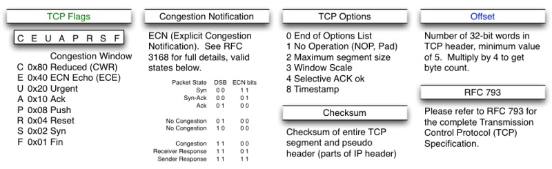

# TCP 协议

TCP 是 _全双工 (full deplex)_ 的，允许数据在两个方向上同时进行传输。

TCP 的重点在于**可靠**的数据传输。IP 和 UDP 不进行任何的 retry；Ethernet 会做一些 retry，但是不会坚持。TCP 则会坚持进行重传 (retransmission)。

IP 层可能会出现的问题：

+ Packet bit error
+ Packet drop (丢包)
+ Packet reordering (包乱序)
+ Packet duplication

其中 packet bit error 和 packet drop 的问题用 acknowledgement 来解决；packet reordering 和 packet duplication 的问题用 sequence number 来解决。

## TCP header

+ Sequence number (SYN): 包的序号，用来解决网络包乱序 (reordering) 的问题
+ Acknowledgement number (ACK): 用来确认收到，解决丢包的问题
+ Window: 滑动窗口，解决流量控制问题
+ TCP flags: 代表包的类型，用来操作 TCP 的状态机

## TCP 状态机

## 连接过程

### 建立连接：三次握手

主要是要初始化 Sequence Number 的初始值。通信的双方要互相通知对方自己的初始化的 Sequence Number（缩写为 ISN：Inital Sequence Number）——所以叫 SYN，全称 Synchronize Sequence Numbers。也就上图中的 x 和 y。这个号要作为以后的数据通信的序号，以保证应用层接收到的数据不会因为网络上的传输的问题而乱序（TCP 会用这个序号来拼接数据）

### 断开连接：四次挥手

其实你仔细看是 2 次，因为 TCP 是全双工的，所以，发送方和接收方都需要 Fin 和 Ack。只不过，有一方是被动的，所以看上去就成了所谓的 4 次挥手。如果两边同时断连接，那就会就进入到 CLOSING 状态，然后到达 TIME_WAIT 状态。

## 流量控制

### 滑动窗口

Sender 和 receiver 都有一个滑动窗口。