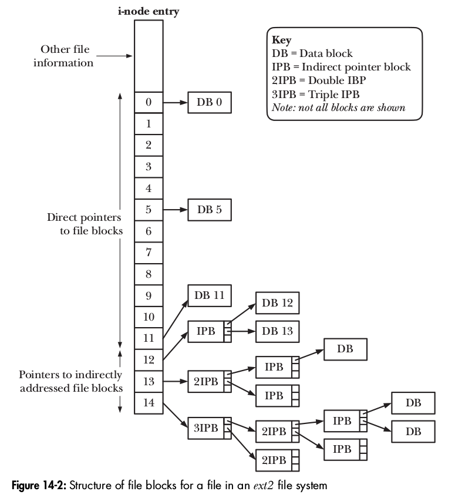
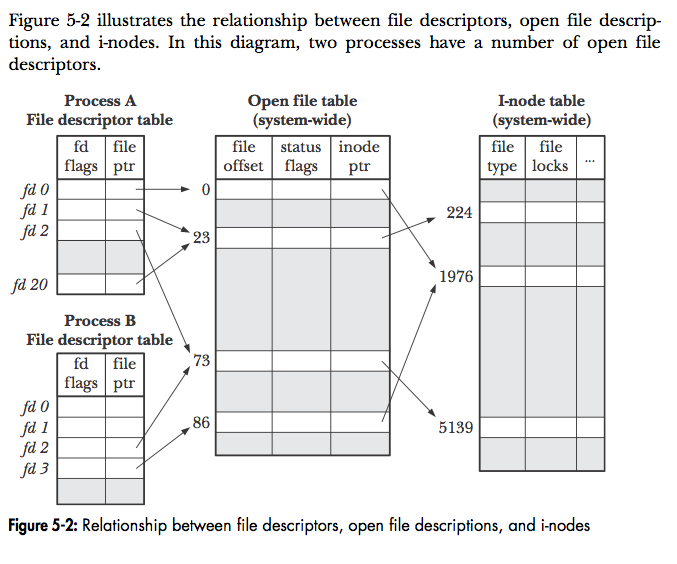

# 操作系统 - 文件系统

## 文件系统

### Block

磁盘中数据读写的基本单位是**扇区 (sector)**，也叫做 physical block，一般大小是 512 B = 0.5 KB。而文件系统中的概念是 (logical) block，一般大小是 4KB。

### 文件系统结构

+ 磁盘 = 多个磁盘分区 (partition)
+ 分区 = _boot block_ + _superblock_ + inodes + data blocks
  + Boot block —— 文件系统不使用
  + Superblock —— 存储文件系统元信息，如 inode 的数量
  + Inode —— 每个固定 128B 大小
  + Data block —— 实际数据

分区格式化的时候会设定有多少个 inode。如果分区里的小文件很多，inode 用完了的话，即使数据块还有剩余，也放不了新文件了。`df -i` 可以查看文件系统的 inode 使用情况。

## inode

inode 全名是 _index node_。其中存储文件的元信息。可以用 `stat` 命令查看文件的 inode 信息。

### inode 信息

这些信息应该都可以由 `ls -l` 命令显示出来，或者由 `stat()` 函数获得。

+ 文件类型（regular file, directory, symbolic link, device, socket）
+ UID 和 GID
+ 访问权限（例如 `rw-rw-r--`）
+ 时间戳：最后访问、最后修改、最后状态改变
+ 硬链接数量
+ 文件大小
+ 文件的 block 数量
+ 指向 data blocks 的指针
  + 12 个直接指针
  + 3 个间接指针（1/2/3 级）

### inode 与文件名

inode 中保存文件的各种信息，唯独**不包括文件名**。Linux 使用 inode 号码来识别文件，而不是文件名。`ls -i` 命令可以从文件名获取 inode 号码。

Linux 文件的文件名存储在目录文件中。目录是一个特殊的文件，每个目录文件中存储是若干 (file name, inode number) 的项。由于目录文件内只有文件名和 inode 号码，所以如果只有读权限 (r)，只能获取文件名，无法获取其他信息，因为其他信息都储存在 inode 中，而读取 inode 内的信息需要目录文件的执行权限（x）。

### 硬链接与软链接

`ln` 命令可以创建硬链接，使多个文件名对应同一个 inode。当链接数减为 0 的时候，文件会被删除。这就是为什么删除文件的函数是 `unlink`。`ln -s` 命令创建软链接。软链接指向目标文件的文件名，而不是 inode 号码。

参考：

+ _The Linux Programming Interface_, Section 14.4
+ [理解inode - 阮一峰](http://www.ruanyifeng.com/blog/2011/12/inode.html)

## 文件描述符 file descriptor

文件描述符是非负整数，描述**打开的文件**。

+ 0 —— stdin 标准输入
+ 1 —— stdout 标准输出
+ 2 —— stderr 标准错误

Unix 内核会为每个进程维护一个**文件描述符表** (_file descriptor table_)。文件描述符则是这个表的 index，指向**打开文件表** (_open file table_) 中的一项。通过 `dup` / `dup2` 函数，两个文件描述符可以指向同一个打开文件表项。

打开文件表记录了文件的 offset 和 flags（`open()` 的参数），以及指向 _inode table_ 中的一项。一个文件可以被打开多次，有多个打开文件表项，它们的 offset 和 flags 不同，但指向同一个 inode。

（图片来自 _The Linux Programming Interface_）详情参考书的 5.4 节。
