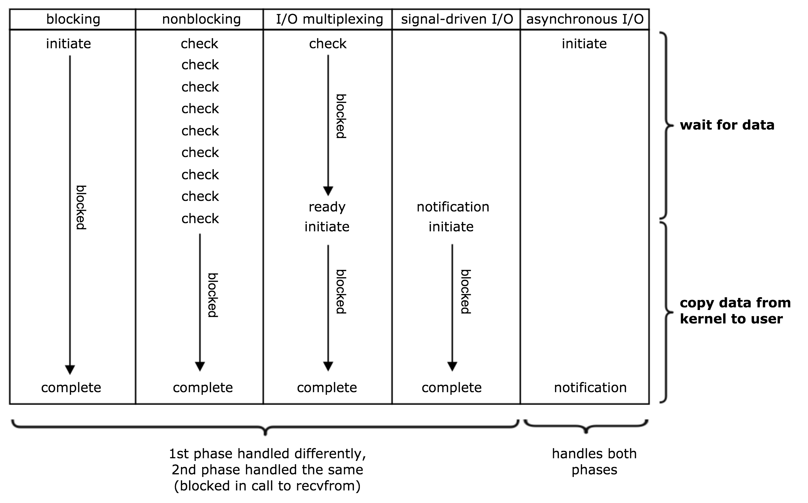

# 操作系统 - I/O 模型

五种典型的 I/O 模型：

+ 阻塞 I/O (Blocking I/O, BIO)
  + 最常用，最简单，默认模型
+ 非阻塞 I/O (Non-blocking I/O, NIO)
  + 轮询式
+ 多路复用 I/O (Multiplexing I/O)
  + `select` / `poll` / `epoll`
+ 信号驱动式 I/O (Signal-driven I/O, SIGIO)
  + 不太重要
+ 异步 I/O (Asynchronous I/O, AIO)
  + `aio_read` 或 libevent 函数库
  + 前几个模型都可以叫做同步 I/O

一次 IO 包括两个阶段：

+ 等待数据（到达内核缓冲区）
  + 例如，等待网络上的数据送达
  + IO 密集阶段
+ 将数据从内核缓冲区复制到进程缓冲区
  + 内核空间 -> 用户空间
  + CPU 密集阶段

| I/O 模型 | 第一阶段 | 第二阶段 |
| :-: | :-: | :-: |
| BIO | 阻塞 | 阻塞 |
| NIO | 非阻塞（需要轮询）| 阻塞 |
| Select/poll | 阻塞 | 阻塞 |
| AIO | 非阻塞 | 非阻塞 |

其中 Select/poll 虽然和 BIO 都是阻塞，但 select/poll 可以同时处理多个 I/O。

（图片来自 _Unix Network Programming, Volumn I_ Section 6.2 Figure 6.6）

参考：

+ _Unix Network Programming, Volumn I_, Section 6.2 - I/O Models
+ [聊聊同步、异步、阻塞与非阻塞](https://www.jianshu.com/p/aed6067eeac9)
+ [聊聊 Linux 五种 IO 模型](https://www.jianshu.com/p/486b0965c296)

## 阻塞 I/O

## 非阻塞 I/O

## 多路复用 I/O

+ select
  + 限制 descriptor 的数量为 1024 个
  + 参数是 in-out 的，每次调用都需要重新设置参数
  + 集合用数组表示，需要遍历
+ poll
  + 不限制 descriptor 的数量
  + 但仍需要线性遍历
+ epoll
  + 不需要线性遍历
  + 因此能处理更多的事件，性能更好

epoll 有多个 API

+ `epoll_create`
  + 打开一个 epoll file descriptor
+ `epoll_ctl`
  + 添加或删除监听事件
+ `epoll_wait`
  + 等待监听的事件
  + 返回 events

## AIO

TODO