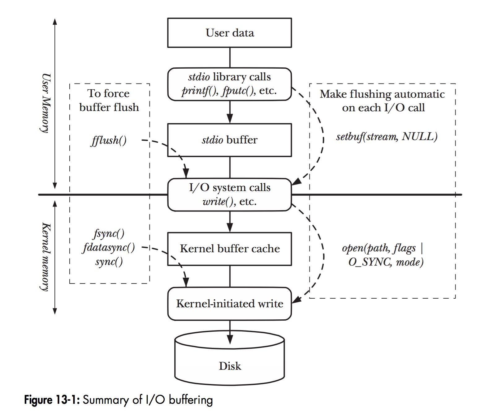

# Linux I/O

## I/O 与缓存

操作系统的虚拟存储器，会在内存中维护页框（page frame），作为磁盘页的缓存。页框是进程共享的，存储在内核空间中（0xc000000 以上地址）。一般的 I/O 过程，需要将数据从内核空间的页框复制到用户空间的缓冲区。有些时候我们不需要这些缓存机制，需要去掉 I/O 中的缓存：可以使用一些**零拷贝** (_zero copy_) 机制。

### 直接 I/O

+ `open` 系统调用的 `O_DIRECT` 参数（Linux 2.4 以后支持）
+ Java 中貌似没有直接支持，有一个库 [Jaydio](https://github.com/smacke/jaydio)

### 内存映射 mmap

+ `mmap` 系统调用
+ 除了避免拷贝，还可以用于进程之间通信，共享一块内存空间
+ Java NIO 有 `FileChannel.map`

### sendfile

+ `sendfile` 系统调用
+ 无法修改文件内容，仅适合文件搬运
+ Java NIO 有 `FileChannel.transferTo`

### 参考

+ 缓存与虚拟存储器的关系：[Page Cache, the Affair Between Memory and Files](https://manybutfinite.com/post/page-cache-the-affair-between-memory-and-files/)（文章不一定好，稍微看看）
+ 几种 zero copy 方式与 Java 中的实现：[It's all about buffers: zero-copy, mmap and Java NIO](https://xunnanxu.github.io/2016/09/10/It-s-all-about-buffers-zero-copy-mmap-and-Java-NIO/)
  + 在 Java 中，要理解 `ByteBuffer` 的三个子类：`HeapByteBuffer`，`DirectByteBuffer` 和 `MappedByteBuffer`

（图片来自 _The Linux Programming Interface_）

## Socket 编程

send / recv 见 APUE 第 16 章。

## Linux 的 IO 模型

五种典型的 I/O 模型：

+ 阻塞 I/O (Blocking I/O, BIO)
  + 最常用，最简单，默认模型
+ 非阻塞 I/O (Non-blocking I/O, NIO)
+ 多路复用 I/O (Multiplexing I/O)
  + 也叫 select/poll
+ 信号驱动式 I/O (Signal-driven I/O, SIGIO)
  + 不太重要
+ 异步 I/O (Asynchronous I/O, AIO)
  + `aio_read` 或 libevent 函数库
  + 前三个都可以叫做同步 I/O

一次 IO 包括两个阶段：

1. 等待数据（到达内核缓冲区）：此时是 IO 密集阶段
1. 将数据从内核缓冲区复制到进程缓冲区：此时是 CPU 密集阶段

| I/O 模型 | 第一阶段 | 第二阶段 |
| :-: | :-: | :-: |
| BIO | 阻塞 | 阻塞 |
| NIO | 非阻塞（需要轮询）| 阻塞 |
| Select/poll | 阻塞 | 阻塞 |
| AIO | 非阻塞 | 非阻塞 |

其中 Select/poll 虽然和 BIO 都是阻塞，但 select/poll 可以同时处理多个 I/O。

参考：

+ [聊聊同步、异步、阻塞与非阻塞](https://www.jianshu.com/p/aed6067eeac9)
+ [聊聊 Linux 五种 IO 模型](https://www.jianshu.com/p/486b0965c296)

### 多路复用 I/O

TODO select, poll, epoll