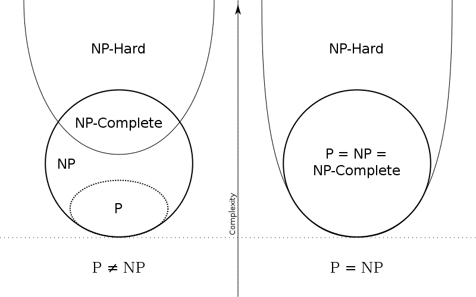

# P vs NP

参考图片。

## 伪多项式时间算法 (Pseudo-polynomial time)

算法的时间复杂度是输入数据的多项式表达，但却是输入数据长度的指数时间表达。

参考[StackOverflow](https://stackoverflow.com/questions/19647658/what-is-pseudopolynomial-time-how-does-it-differ-from-polynomial-time)和其[翻译](https://www.zhihu.com/question/20013122/answer/44460397)。

典型的伪多项式时间算法：

+ 背包问题（动态规划算法）
+ 素数判断算法

## 图片

